# iTerm2

## Hablemos de iTerm2

iTerm2 es un emulador de termianl para OS X, que facilita el trabajo en terminal, si eres de los que pasa la mayoria del tiempo trabajando con la terminal, esta es tu mejor opcion, yo como desarrollador lo uso todo el tiempo, sus caracteristicas son muchas y aqui les hablare de cada una de ellas.

### Características Principales

**Paneles Divididos**

Esta es una de las características más increíbles, si no es que es la mejor, su facilidad de dividir una pestaña de la terminal en paneles en cual cantidad que quieras de modo horizontal o vertical, sin duda alguna es de lo más usado en Hipatia Dev House.

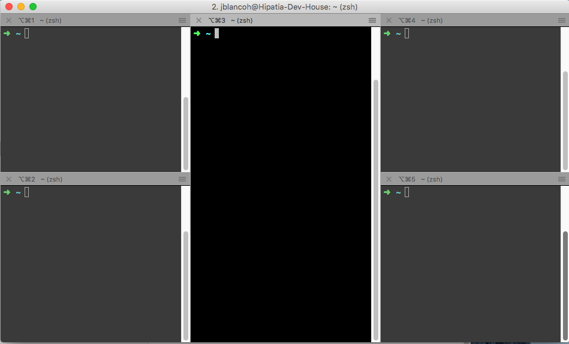

**Ventana de Acceso Rápido**

Ventana de acceso rápido a la terminal, podemos configurar una tecla para poder tener a iTerm2 en primer plano aunque estemos usando cualquier aplicación, así podemos tener accesos a nuestra terminal en cualquier momento.

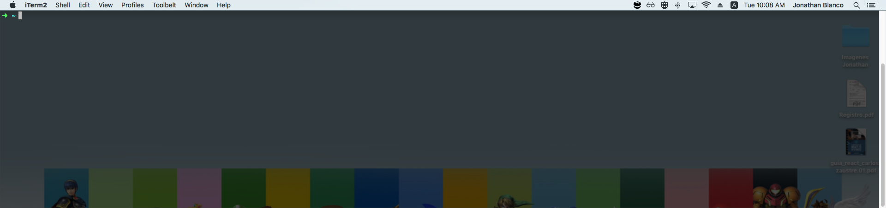

**Búsqueda**

iTerm2 viene con un gran buscador, así evitamos la interfaz de usuario, y destaca todos los resultados encontrados.

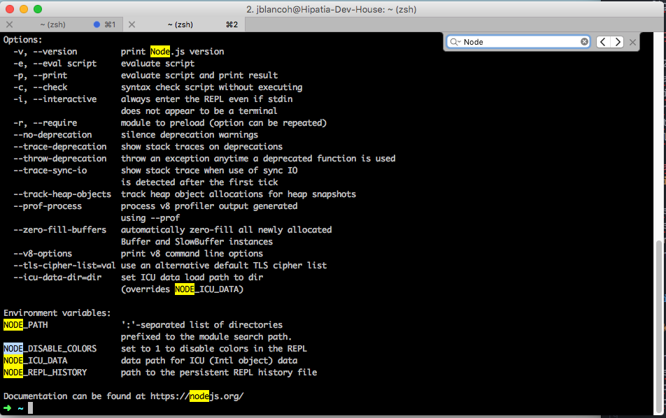

**Autocompletado**

Solo basta con escribir cualquier palabra que previamente apareció en la ventana y luego presionar "Cmd" + ";", esto nos abrirá una ventana con palabras sugeridas con la que podemos autocompletar lo que queremos escribir.

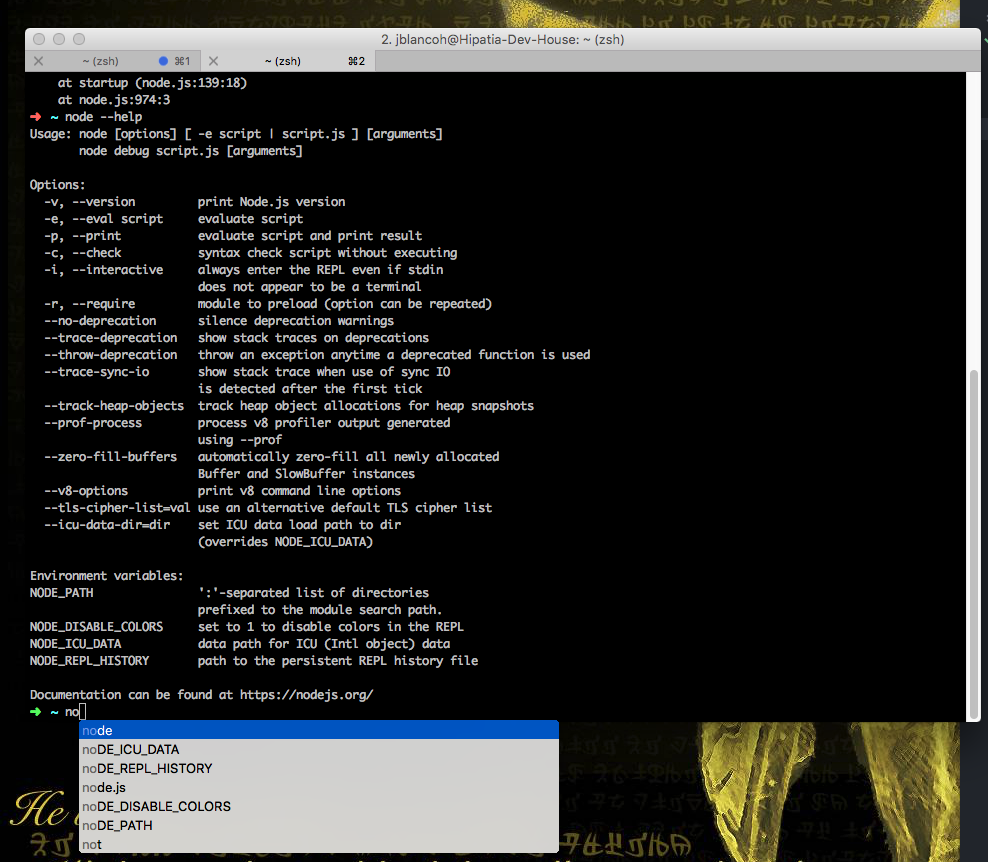

**Copiar Sin Mouse**

Podemos copiar sin usar el mouse, usamos el buscador de texto para esta característica y buscamos algún texto que queremos copiar, presionamos la tecla "tab" para expandir la selección hacia la derecha o "shift" + "tab" para expandir la selección hacia la izquierda, luego "option" + "enter" pega el texto que coincide.

**Historial de Pegado**

El historial de pegado le permite revisar el texto copiado o pegado recientemente, oprimiendo las teclas "cmd" + "shift" + "H"

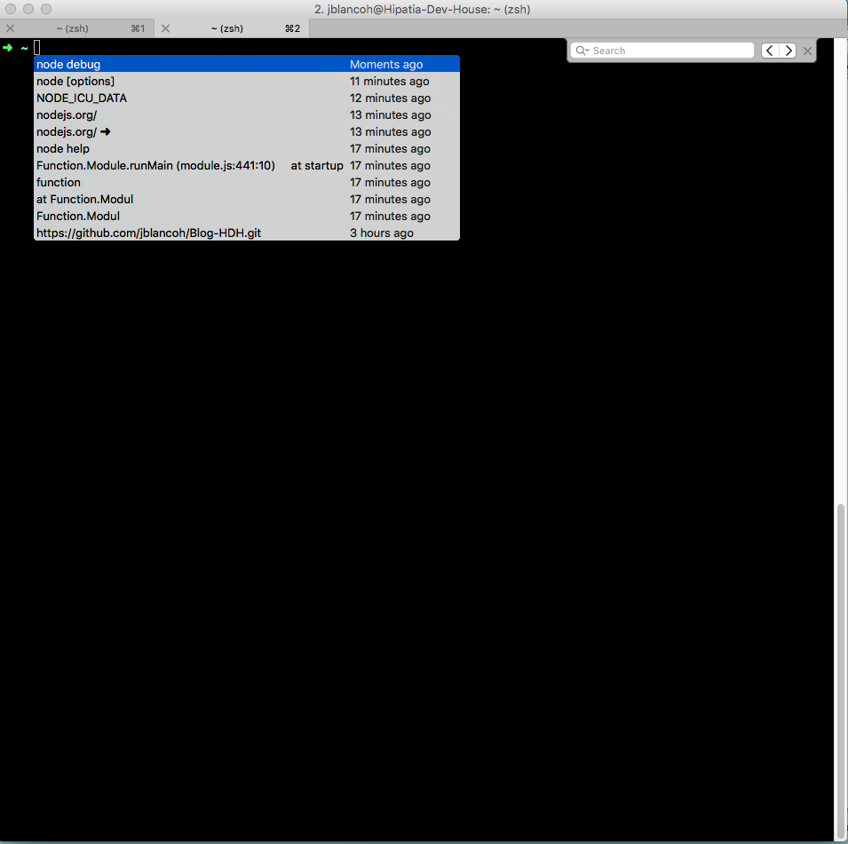

**Repetición Instantánea**

Esta característica nos permite viajar en el tiempo para ver lo que hemos hecho en nuestra terminal, accedemos a ella con "alt" + "cmd" + "B".

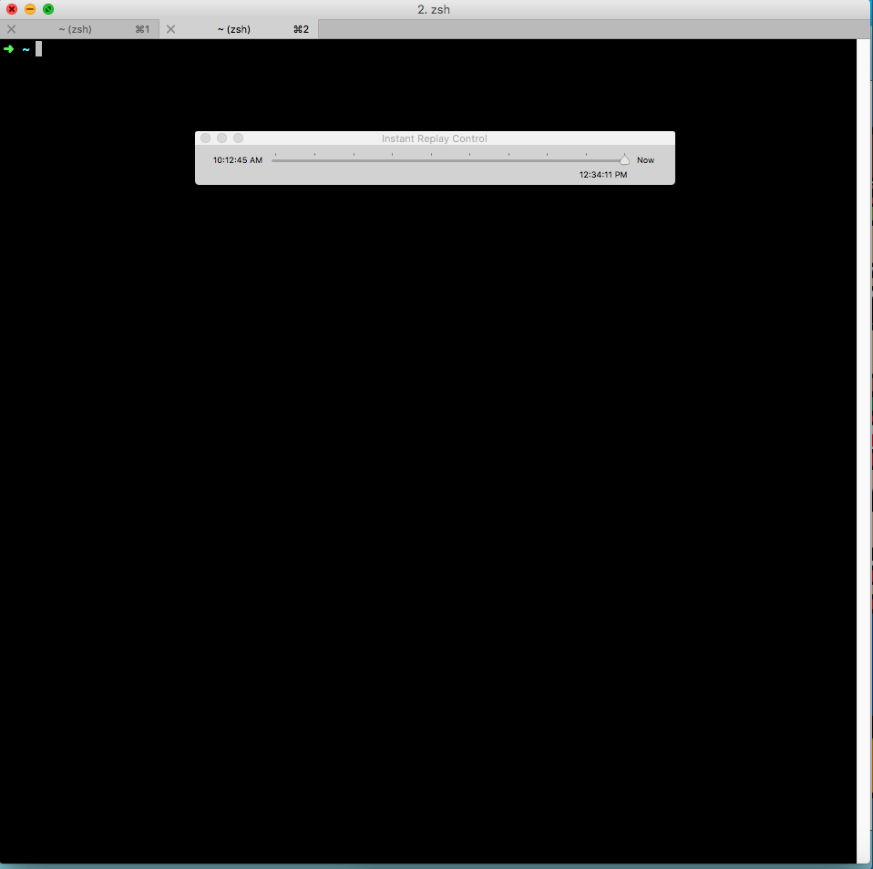

**Configurabilidad**

Podemos configurar cualquier tecla a cualquier función de iTerm2, se puede personalizar la apariencia, permite transparencia, desenfoque de fondo, imágenes de fondo y algunas cosas mas.

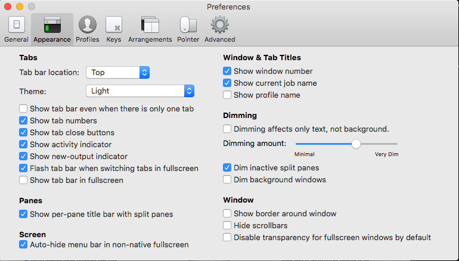

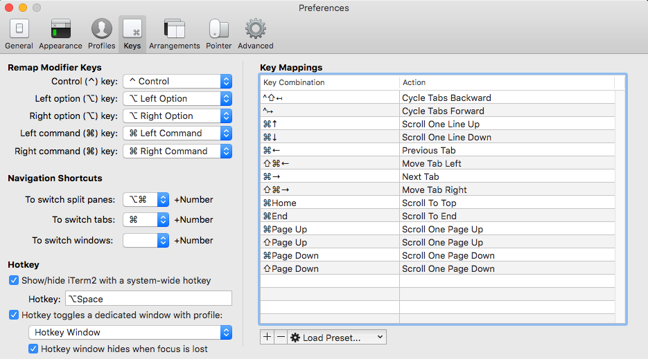

**Características Unix**

Si anteriormente has trabajado con sistemas Unix, te sentirás como en casa con el enfoque sigue el mouse, copiar al seleccionar, pegar con el botón del medio del mouse, y atajos de teclado para evitar el uso de mouse.

**256 Colores (o mas!)**

Con el modo 256 colores, la terminal es una mezcla de colores, como que el código cobra vida.

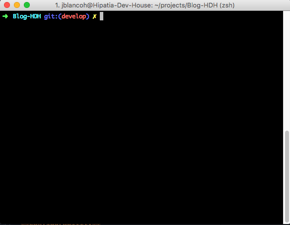

**Legibilidad**

De vez en cuando al usar la terminal solemos perder el cursor, con las funciones
"Smart Cursor Color" y "Minimal Contrast", aseguramos que estos problemas de perdida de cursor se vayan para siempre.

**Informe de Mouse**

Con esta característica podemos colocar el cursor en un linea, resaltar texto y realizar algunas otras funciones en programas como Vim.

**Soporte Growl**

Viene una opción para recibir notificaciones Growl de actividad, campanas y mas, esto es funcional para dejar trabajando la terminal en segundo plano y al momento de terminar recibiremos una notificación de actividad.

**Exposé Tab**

Muestra todas las pestañas en una sola pantalla, y al mismo tiempo realizar una búsqueda a través de ellas.

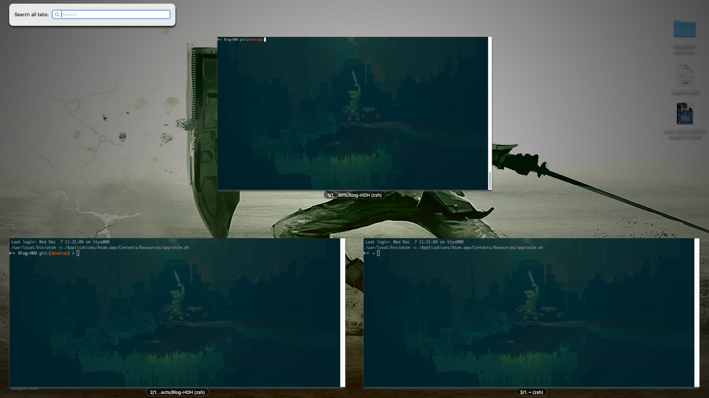

**Perfiles Etiquetados**

iTerm2 proporciona una base de datos de perfiles y una busqueda de los mismos, esta funcion es util si queremos tener diversar configuraciones almecenadas e identificadas.

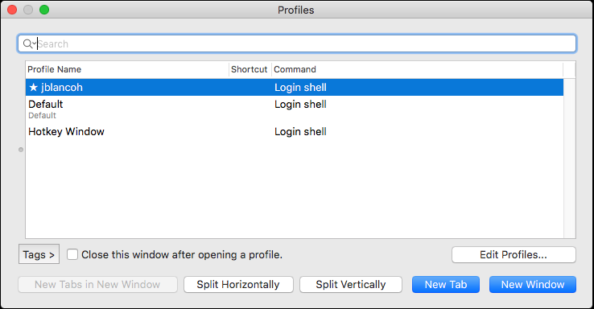

**Multilenguaje**

Cuenta con soporte de internacionalización, incluye soporte para todos los planos UNICODE.

**Disparadores (Triggers)**

Admite disparadores definidos por cada usuario, son acciones que se ejecutan cuando se recibe texto que coincide con una expresión regular, lo podemos usar para resaltar las palabras, responder automáticamente a las indicaciones, notificar cuando suceda algo importante y mas.

**Selección Inteligente**

Puede realizar selecciones inteligentes para resaltar direcciones URL, dirección de correo electrónico, nombre de archivos y mas, reconociendo lo que esta debajo del cursor y eligiendo cuanto texto seleccionar.
